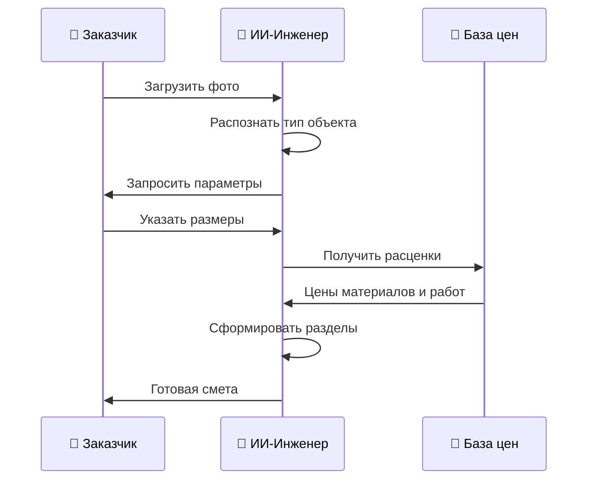
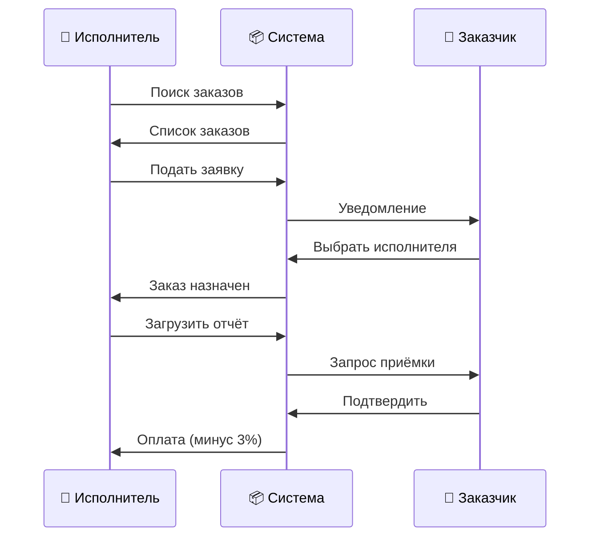
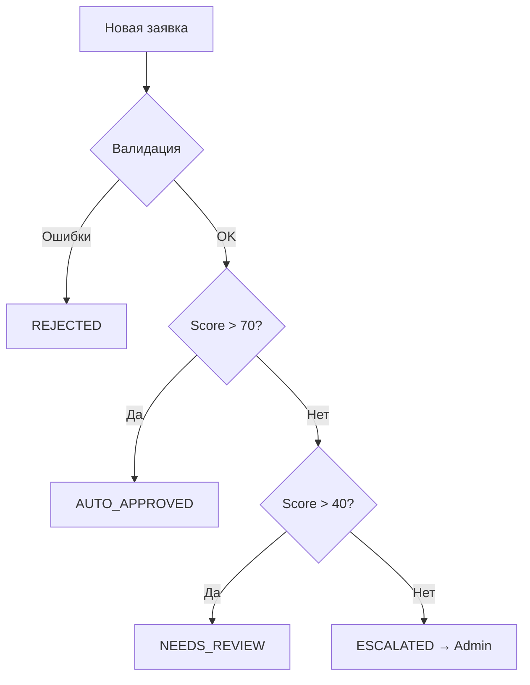

# 🏗️ QAZGOST AI — Система расчёта смет

## Содержание

1. [Разделы сметы](#разделы-сметы)
2. [Логика расчётов](#логика-расчётов)
3. [Роли пользователей](#роли-пользователей)
4. [Workflow по ролям](#workflow-по-ролям)

---

# Разделы сметы

## 01. 🏗️ Земляные работы

### Описание

Работы по разработке грунта, устройству котлована или траншеи под фундамент.

### Пункты раздела

| Пункт | Описание | Единица |
|-------|----------|---------|
| Разработка грунта | Ручная или механизированная копка траншей/котлована | м³ |
| Обратная засыпка | Засыпка пазух после бетонирования | м³ |

### Формулы расчёта

```
Объём выемки = Периметр × Ширина × (Высота + Глубина) × 1.5 (коэф. откоса)

Пример: 40м × 0.4м × 1.3м × 1.5 = 31.2 м³
```

### Расценки

- Ручная копка: **2,500 ₸/м³**
- Механизированная: **800 ₸/м³**
- Обратная засыпка: **600 ₸/м³**

---

## 02. ⬛ Подготовка основания

### Описание

Устройство подстилающих слоёв под фундамент: песчаная подушка, щебёночная подготовка, геотекстиль.

### Пункты раздела

| Пункт | Описание | Материалы |
|-------|----------|-----------|
| Песчаная подушка | Слой песка 200мм с трамбовкой | Песок карьерный |
| Щебёночная подготовка | Слой щебня 150мм | Щебень 5-20мм |
| Геотекстиль | Разделительный слой | Геотекстиль |

### Формулы расчёта

```
Песок:
  Объём = Площадь × 0.2м (толщина)
  Пример: 16 м² × 0.2м = 3.2 м³

Щебень:
  Объём = Площадь × 0.15м
  Пример: 16 м² × 0.15м = 2.4 м³

Геотекстиль:
  Площадь = Площадь основания × 1.1 (перехлёст)
```

### Расценки

| Материал | Цена | Работа | Цена |
|----------|------|--------|------|
| Песок карьерный | 3,500 ₸/м³ | Устройство подушки | 350 ₸/м² |
| Щебень 5-20 | 4,500 ₸/м³ | Устройство подготовки | 400 ₸/м² |
| Геотекстиль | 85 ₸/м² | — | — |

---

## 03. 📐 Опалубочные работы

### Описание

Монтаж и демонтаж опалубки для бетонирования.

### Пункты раздела

| Пункт | Описание | Материалы |
|-------|----------|-----------|
| Монтаж опалубки | Установка щитов | Фанера/металл |
| Демонтаж опалубки | Разборка после набора прочности | — |

### Формулы расчёта

```
Площадь опалубки (лента):
  S = Периметр × Высота × 2 (обе стороны)
  Пример: 40м × 1.3м × 2 = 104 м²

Площадь опалубки (плита):
  S = Периметр плиты × Толщина
```

### Расценки

| Материал | Цена | Работа | Цена |
|----------|------|--------|------|
| Опалубка (фанера) | 1,500 ₸/м² | Монтаж | 800 ₸/м² |
| Опалубка (металл) | 2,500 ₸/м² | Демонтаж | 300 ₸/м² |

---

## 04. 🔩 Арматурные работы

### Описание

Изготовление и монтаж арматурных каркасов.

### Пункты раздела

| Пункт | Описание | Материалы |
|-------|----------|-----------|
| Арматура d12 | Рабочая арматура ленты | Арматура A500C |
| Арматура d14 | Рабочая арматура плиты | Арматура A500C |
| Армирующая сетка | Для стяжки/пола | Сетка 100×100×4 |

### Формулы расчёта

```
Ленточный фундамент:
  Длина арматуры = Периметр × 8 прутков
  Масса = Длина × 0.888 кг/м (для d12)
  
  Пример: 40м × 8 = 320м → 320 × 0.888 = 284 кг

Плитный фундамент:
  Длина = (Сторона / Шаг + 1) × Сторона × 2 направления × 2 сетки
  Шаг сетки обычно 200мм
```

### Таблица весов арматуры (кг/м)

| Диаметр | Вес кг/м |
|---------|----------|
| d8 | 0.395 |
| d10 | 0.617 |
| d12 | 0.888 |
| d14 | 1.21 |
| d16 | 1.58 |
| d18 | 2.0 |
| d20 | 2.47 |

### Расценки

| Материал | Цена | Работа | Цена |
|----------|------|--------|------|
| Арматура d12 | 450 ₸/кг | Армирование | 35 ₸/кг |
| Арматура d14 | 480 ₸/кг | Вязка каркаса | 12,000 ₸/т |
| Сетка 100×100 | 120 ₸/м² | — | — |

---

## 05. 🧱 Бетонные работы

### Описание

Укладка и уплотнение бетонной смеси.

### Пункты раздела

| Пункт | Применение | Марка бетона |
|-------|------------|--------------|
| Бетонирование М300 | Ленточный фундамент | М300 (B22.5) |
| Бетонирование М350 | Плитный фундамент | М350 (B25) |

### Формулы расчёта

```
Ленточный фундамент:
  Объём = Периметр × Ширина × (Высота + Глубина)
  + 5% запас на потери
  
  Пример: 40м × 0.4м × 1.3м = 20.8 м³ → 21.84 м³

Плитный фундамент:
  Объём = Площадь × Толщина × 1.05
  
  Пример: 100 м² × 0.3м × 1.05 = 31.5 м³
```

### Расценки

| Материал | Цена | Работа | Цена |
|----------|------|--------|------|
| Бетон М300 | 28,000 ₸/м³ | Укладка | 3,500 ₸/м³ |
| Бетон М350 | 32,000 ₸/м³ | Укладка плиты | 4,500 ₸/м³ |

---

## 06. 🧱 Кладочные работы

### Описание

Возведение стен из кирпича или блоков.

### Пункты раздела

| Пункт | Материал | Расход на м² |
|-------|----------|--------------|
| Кирпичная кладка | Кирпич М150 | 50 шт/м² |
| Кладка газоблоков | D500 | 12 шт/м² |

### Формулы расчёта

```
Кирпич:
  Количество = Площадь стены × 50 шт/м²
  Раствор = Площадь × 0.02 м³/м²

Газоблок:
  Количество = Площадь стены × 12 шт/м²
  Клей = Площадь × 1.5 кг/м²
```

### Расценки

| Материал | Цена | Работа | Цена |
|----------|------|--------|------|
| Кирпич красный | 18 ₸/шт | Кладка кирпича | 1,800 ₸/м² |
| Газоблок D500 | 320 ₸/шт | Кладка блоков | 1,200 ₸/м² |
| Раствор М100 | 4,500 ₸/м³ | — | — |
| Клей для блоков | 150 ₸/кг | — | — |

---

## 07. 💧 Гидроизоляция

### Описание

Защита конструкций от влаги.

### Пункты раздела

| Пункт | Материал | Расход |
|-------|----------|--------|
| Обмазочная | Битумная мастика | 1.5 кг/м² |
| Оклеечная | Рубероид | 1.1 м²/м² |
| Плёночная | ПЭ плёнка | 1.1 м²/м² |

### Формулы расчёта

```
Обмазочная:
  Праймер = Площадь × 0.3 л/м²
  Мастика = Площадь × 1.5 кг/м²

Плёночная:
  Плёнка = Площадь × 1.1 (перехлёст)
```

### Расценки

| Материал | Цена | Работа | Цена |
|----------|------|--------|------|
| Праймер | 450 ₸/л | Гидроизоляция | 280 ₸/м² |
| Мастика | 380 ₸/кг | — | — |
| Плёнка ПЭ | 35 ₸/м² | — | — |

---

## 08. 🏠 Устройство полов

### Описание

Устройство стяжки и покрытий пола.

### Пункты раздела

| Пункт | Толщина | Материал |
|-------|---------|----------|
| Цементная стяжка | 50-100 мм | Пескобетон М300 |
| Наливной пол | 5-20 мм | Самонивелир |

### Формулы расчёта

```
Стяжка:
  Объём = Площадь × Толщина × 1.05
  
  Пример: 80 м² × 0.05м = 4 м³ → 4.2 м³
```

### Расценки

| Материал | Цена | Работа | Цена |
|----------|------|--------|------|
| Пескобетон М300 | 4,500 ₸/м³ | Стяжка | 550 ₸/м² |
| Сетка | 120 ₸/м² | Наливной пол | 450 ₸/м² |

---

# Роли пользователей

## 👤 CUSTOMER (Заказчик)

### Описание

Владелец объекта, заказывающий расчёт или строительные работы.

### Возможности

| Действие | Описание |
|----------|----------|
| Загрузить фото | Фотографии объекта для распознавания |
| Выбрать тип объекта | Ленточный фундамент, стена и т.д. |
| Указать параметры | Размеры, площадь, этажность |
| Получить смету | Автоматический расчёт стоимости |
| Скачать PDF | Документ для подрядчика |
| Создать заказ | Опубликовать на маркетплейсе |

### Workflow

```
1. Загрузка фото → 2. Распознавание → 3. Уточнение параметров → 4. Смета → 5. PDF/Заказ
```

---

## 🔧 EXECUTOR (Исполнитель)

### Описание

Строительная бригада или подрядчик, выполняющий работы.

### Возможности

| Действие | Описание |
|----------|----------|
| Поиск заказов | Фильтрация по типу, региону, бюджету |
| Подать заявку | Откликнуться на заказ |
| Указать цену | Своя стоимость выполнения |
| Загрузить фото работ | Отчёт о выполнении |
| Сдать этап | Передать заказчику |
| Получить оплату | После приёмки |

### Комиссия

- **3%** от суммы заказа при получении

### Workflow

```
1. Поиск заказов → 2. Отклик → 3. Согласование → 4. Выполнение → 5. Сдача → 6. Оплата
```

---

## 🤖 AI-ENGINEER (ИИ-Инженер)

### Описание

Автоматизированная система, заменяющая роль инженера.

### Функции

| Модуль | Файл | Функция |
|--------|------|---------|
| Валидатор | `aiEngineerValidator.js` | Проверка корректности данных |
| Модератор | `aiEngineerModerator.js` | Автоодобрение заявок |
| Сметчик | `aiEstimator.js` | Генерация смет по разделам |
| База цен | `aiPriceDatabase.js` | Актуальные расценки |
| Консультант | `aiEngineerChat.js` | Ответы на вопросы |

### Автоодобрение

| Критерий | Порог |
|----------|-------|
| Сумма заявки | до 50 млн ₸ |
| Score | > 70 баллов |
| Ошибки валидации | 0 |

### Workflow

```
Заявка → Валидация → Score → [AUTO_APPROVED | NEEDS_REVIEW | ESCALATED]
```

---

## 👑 ADMIN (Администратор)

### Описание

Супер-пользователь с полным доступом.

### Возможности

| Действие | Описание |
|----------|----------|
| Все функции Заказчика | ✅ |
| Все функции Исполнителя | ✅ |
| Модерация заявок | Ручная проверка эскалированных |
| Управление пользователями | Блокировка, верификация |
| Редактирование цен | Обновление прайс-листа |
| Аналитика | Статистика системы |

### Переключение режима

```javascript
DataService.setAdminViewRole('customer');  // Режим заказчика
DataService.setAdminViewRole('executor');  // Режим исполнителя
```

---

# Workflow по ролям

## Сценарий 1: Заказчик создаёт смету



## Сценарий 2: Исполнитель берёт заказ



## Сценарий 3: ИИ модерирует заявку



---

# Региональные коэффициенты

| Город | Коэффициент | Пример (бетон М300) |
|-------|-------------|---------------------|
| Алматы | 1.0 | 28,000 ₸ |
| Астана | 1.15 | 32,200 ₸ |
| Атырау | 1.25 | 35,000 ₸ |
| Шымкент | 0.95 | 26,600 ₸ |
| Караганда | 1.05 | 29,400 ₸ |

---

# Версионирование

- **Версия прайса:** 2026.01
- **Дата обновления:** 2026-01-31
- **Всего материалов:** 50+
- **Всего работ:** 30+
